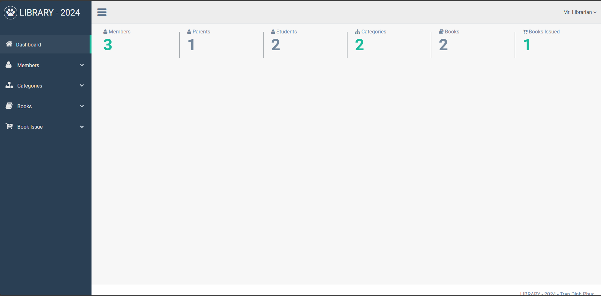

Hệ thống quản lý thư viện được phát triển trong Spring Boot.

Nó cung cấp những gì?
Nó cho phép người dùng quản lý Thành viên, Danh mục, Sách và Phát hành Sách.

Thiết lập dự án
Thiết lập cơ sở dữ liệu
Dự án yêu cầu cơ sở dữ liệu MySQL. Phiên bản của cơ sở dữ liệu được ưu tiên là 8.0 trở lên

Mã thiết lập
Tạo một tệp .war của dự án và triển khai nó trên một máy chủ web như Apache tomcat.

Đăng nhập
Để đăng nhập, bạn có thể sử dụng tên người dùng làm 'quản trị viên' và mật khẩu làm 'quản trị viên'.

